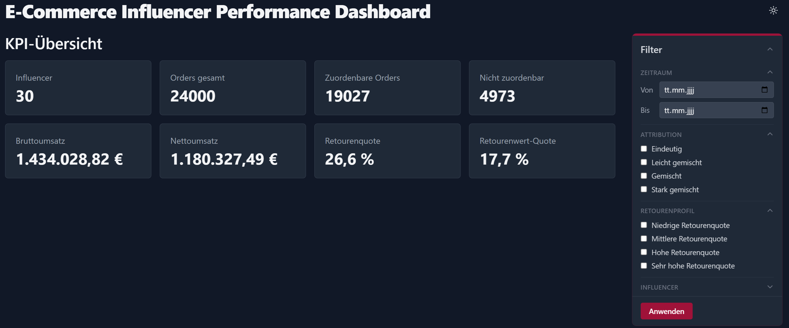
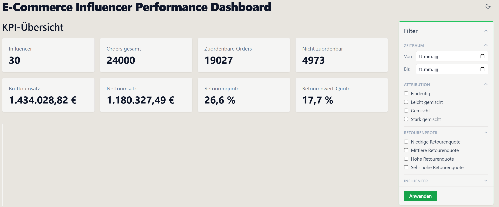
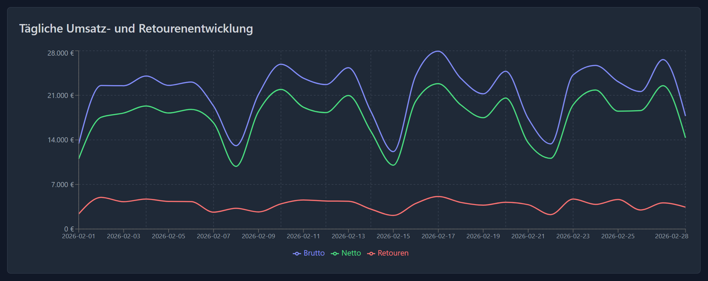
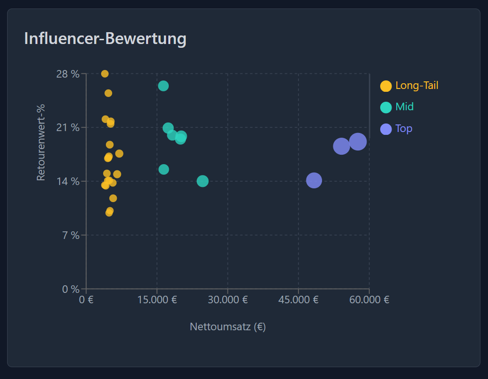
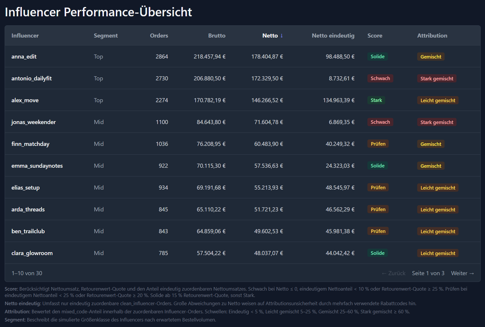
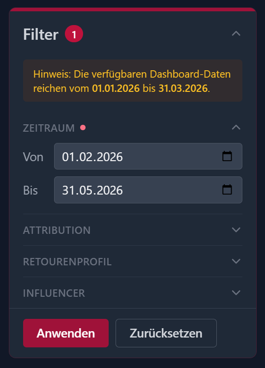

# E-Commerce Influencer Performance Dashboard



Analytisches Dashboard zur wirtschaftlichen Bewertung von Influencer-Kooperationen – auf Basis von Nettoumsatz, Retouren und explizit ausgewiesener Attributionsunsicherheit.

**Live Demo:** [Dashboard öffnen](https://ecommerce-influencer-performance-da.vercel.app)

---

## Projektziel

Influencer-Marketing wird im E-Commerce häufig nur anhand des Bruttoumsatzes bewertet. Zwei entscheidende Faktoren bleiben dabei außen vor: Retouren reduzieren den tatsächlichen Nettoumsatz teils erheblich, und Discount-Codes werden oft von mehreren Influencern gleichzeitig beworben – eine eindeutige Attribution ist dann nicht möglich.

Dieses Projekt entwickelt ein vollständiges Analyse-Dashboard, das beide Faktoren methodisch korrekt berücksichtigt und Attributionsunsicherheit nicht verbirgt, sondern als konzeptionellen Bestandteil der Analyse ausweist.

## Fachliche Leitfrage

Welche Influencer-Kooperationen leisten wirtschaftlich einen sinnvollen Beitrag, wenn nicht nur Umsatz, sondern auch Retouren und Attributionsunsicherheit berücksichtigt werden?

---

## Screenshots

| Dark Mode | Light Mode |
|---|---|
|  |  |

| Tagesdiagramm | Scatter Plot |
|---|---|
|  |  |

| Tabelle | Filter & Datenzeitraum |
|---|---|
|  |  |

---

## Datenbasis und Datenstrategie

| Datenbasis | Zweck | Im Dashboard |
|---|---|---|
| 24.000 synthetische Orders · 30 Influencer (Supabase) | Dashboard-Auswertung, KPIs, Charts | Ja |
| 150 Seed-Orders im Shopify Dev Store · 156 synchronisierte Orders insgesamt | API-Integrationsnachweis | Nein (ADR-003) |

**Warum synthetische Hauptdatenbasis?**  
Synthetische Daten ermöglichen eine reproduzierbare Demo ohne Abhängigkeit von echten Kundendaten. Alle relevanten Attributions- und Retourenklassen sind gezielt abgedeckt, was mit realen Produktionsdaten in dieser Kontrolliertheit nicht möglich wäre.

**Warum Shopify-API-Stichprobe separat?**  
Die 150 Seed-Orders dienen als technischer Nachweis, dass die Shopify Admin API-Anbindung im Dev-Store-Szenario funktioniert. Dabei wurden Cursor-Pagination, Discount-Code-Matching und Retourenparser erfolgreich validiert. Diese Daten bleiben in der Datenbank erhalten, werden aber gemäß einer expliziten Architekturentscheidung ([ADR-003](docs/decisions/ADR-003-datenbasis-ap6.md)) aus dem Hauptdashboard herausgefiltert – die Trennung verhindert, dass ein methodisch anders gearteter Datensatz die Kennzahlen verfälscht.

---

## Architekturentscheidungen

Die wesentlichen Entwurfsentscheidungen sind als Architecture Decision Records (ADRs) dokumentiert:

| ADR | Entscheidung |
|---|---|
| [ADR-001](docs/decisions/ADR-001-tech-stack.md) | Tech-Stack: Next.js App Router, Supabase, Prisma |
| [ADR-002](docs/decisions/ADR-002-datenmodell.md) | Datenmodell: Rohdaten unveränderlich, Attributionsstatus explizit |
| [ADR-003](docs/decisions/ADR-003-datenbasis-ap6.md) | Datenbasis-Trennung: synthetisch vs. Shopify-Integrationsnachweis |
| [ADR-004](docs/decisions/ADR-004-datenbasis-strategie-shopify-vs-synthetisch.md) | Datenstrategie: Shopify-Stichprobe als technischer Integrationsnachweis |

**Schichtenarchitektur:**  
Businesslogik läuft ausschließlich in `src/logic/` und `src/metrics/` – nie in `src/app/` oder `src/components/`. Datenbankabfragen sind in `src/queries/` parametrisiert und filterbar. Die Shopify-Synchronisationsschicht (`src/sync/`) ist die fachlich kritischste Komponente und von der UI vollständig getrennt.

---

## Features

- **KPI-Übersicht** – Gesamtorders, Brutto-/Nettoumsatz, Retourenquote, Attributionsmix
- **Tagesdiagramm** – Umsatz- und Retourenentwicklung im gewählten Zeitraum
- **Attributionsmix** – `clean_influencer`, `mixed_code`; `unknown` wird nur angezeigt, wenn ein Unknown-Anteil vorhanden ist
- **Top-10-Balkendiagramme** – Umsatz und Retourenquote je Influencer
- **Scatter Plot** – Umsatz × Retourenquote × Ordervolumen auf einen Blick
- **Filter-Sidebar** – Tagesauswahl, Attribution und Retourenprofil (beide auf Influencer-Level), Influencer-Mehrfachauswahl; mit Datenzeitraum-Hinweis
- **Tabelle** – sortierbar nach 8 Spalten, paginiert, URL-basiert (Browser-Zurück-kompatibel)
- **Influencer-Scoring** – 4-stufige Bewertung (`Schwach / Prüfen / Solide / Stark`) nach Nettoumsatz, Retourenwert-Quote und eindeutig zuordenbarem Nettoanteil
- **Light/Dark Mode**

---

## Tech Stack

| Komponente | Technologie |
|---|---|
| Framework | Next.js 14 (App Router, Server Components) |
| Sprache | TypeScript |
| Datenbank | Supabase (Managed PostgreSQL) |
| ORM | Prisma |
| UI | Tailwind CSS · Recharts |
| Deployment | Vercel |

---

## Lokales Setup

```bash
# Abhängigkeiten installieren
npm install

# Umgebungsvariablen vorbereiten
cp .env.example .env
# .env öffnen und lokale Zugangsdaten eintragen

# Prisma Client generieren
npx prisma generate

# Dev-Server starten (.env mit DATABASE_URL erforderlich)
npm run dev
```

Weitere Befehle:

```bash
npm test             # Vitest
npm run typecheck    # tsc --noEmit
npm run lint         # ESLint
npm run build        # Produktions-Build
```

**Umgebungsvariablen:**

| Kontext | Variable | Pflicht |
|---|---|---|
| Vercel / Live-Dashboard | `DATABASE_URL` | Ja |
| Lokale Entwicklung | `DATABASE_URL` | Ja |
| Lokale Entwicklung | `DIRECT_URL` | Empfohlen (Prisma CLI / Migrationen) |
| Shopify-Sync-/Seed-Skripte | `SHOPIFY_STORE_DOMAIN` | Ja |
| Shopify-Sync-/Seed-Skripte | `SHOPIFY_CLIENT_ID` | Ja |
| Shopify-Sync-/Seed-Skripte | `SHOPIFY_CLIENT_SECRET` | Ja |
| Shopify-Sync-/Seed-Skripte | `SHOPIFY_API_VERSION` | Optional |

---

## AI Tooling

Dieses Projekt wurde mit Unterstützung von AI-Werkzeugen entwickelt:

- **Claude Code** – strukturierte Umsetzung, Refaktorierung und Codeprüfung
- **ChatGPT** – fachliche Klärung, Review-Unterstützung und Dokumentationsstruktur

Architekturentscheidungen, Metriklogik und die finale fachliche Bewertung wurden manuell geprüft. AI wurde als Produktivitätswerkzeug eingesetzt, nicht als Ersatz für eigene fachliche Verantwortung.

---

## Dokumentation

| Dokument | Inhalt |
|---|---|
| [docs/decisions/](docs/decisions/) | ADRs: Tech-Stack, Datenmodell, Datenbasis-Strategie |
| [docs/context/](docs/context/) | Fachliche Grundlagen, Metriken, Datenmodell |
| [docs/implementation/01-ap0-architektur-uebersicht.md](docs/implementation/01-ap0-architektur-uebersicht.md) | Architekturübersicht: Schichten, Datenfluss, Abgrenzung |
| [docs/portfolio/](docs/portfolio/) | Projektpräsentation und Screenshots |

